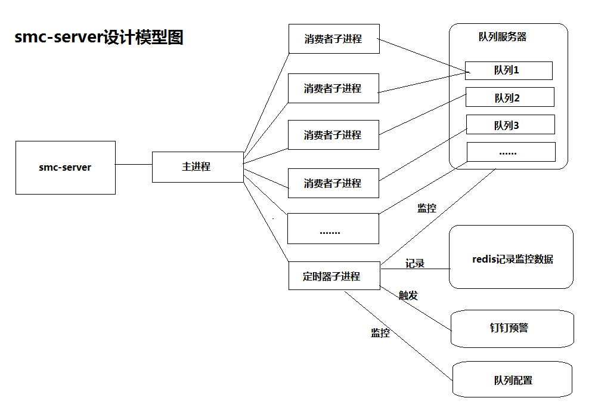

## PHP版本  swoole-multi-consumer

### 简介
swoole-multi-consumer（简称smc-server）使用PHP实现，使用swoole多进程消费者订阅消息，实现自动监控队列的数量，自动伸缩消费者数量，并实现核心配置文件的热加载，目前暂时支持rabbitmq。

### 说明
业务功能的实现都在自身的PHP项目中，smc-server通过方法回调[PHP项目中的方法]进行队列消息的处理和配置文件热加载

### 功能实现
1. 多进程订阅队列消息。
2. 监控队列消息的数量，并自动调整的消费者的数量。
3. 实现核心配置文件的热加载，不用重启服务，smc-server会自动检测并实现子进程的重启。

### 特点
1. 使用swoole process派生子进程，多进程订阅消息队列的数据。
2. 使用swoole\tick定时器监控队列消息积压的情况并使用redis进行记录，实现系统预警以及消费者数量的自动调整。
3. 使用swoole\tick定时检测队列配置的信息，实现热加载。
4. 通过call_user_func_array方法回调处理消息，可以与任何PHP框架无缝结合。

### 设计模型


### 安装
环境依赖：
1. php >= 7.0
2. swoole扩展 >= 1.10.0  //建议并推荐使用4.0.0版本以上
3. redis扩展 >= 3.0 //建议4.0版本以上
4. amqp扩展

##### 接入框架：
- composer require pupilcp/swoole-multi-consumer

### 使用
复制根目录下的globalConfig.demo.php，并重命名为：globalConfig.php，修改配置文件里的参数。
主要配置说明：
```
define('SMC_AMQP_CONSUME', 1); //rabbitmq
define('SMC_APP_PATH', __DIR__ . DIRECTORY_SEPARATOR);
define('SMC_MESSAGE_DRIVER', SMC_AMQP_CONSUME); //消息驱动， 暂时支持rabbitmq

return [
    //通用配置
    'global' => [
        'masterProcessName'   => 'smc-server-master', //主进程名称，如果需要启动多个smc-server的话，必须设置不同的主进程名称
        'enableNotice'        => true, //是否开启预警通知
        'dingDingToken'       => '钉钉机器人token', //钉钉机器人token
        'queueCfgCallback'    => ['\Pupilcp\Service\Test', 'loadQueueConfig'], //必填，smc-server会检测此回调方法，实现队列配置热加载，格式：call_user_func_array方法的第一个参数
        'logPath'             => '日志文件目录',
        //'childProcessMaxExecTime'  => 86400, //子进程最大执行时间，避免运行时间过长，释放内存，单位：秒
        //'baseApplication'        => null, //框架执行命令行，默认为yii1：\Pupilcp\Base\BaseApplication，其它框架请继承\Pupilcp\Base\BaseApplication
        //'smcServerStatusTime' => 120, //可选，定时监测smc-server状态的时间间隔，默认为null，不开启
        //'queueStatusTime'     => 60, //可选，定时监测消息队列数据积压的状态，自动伸缩消费者，默认为null，不开启
        //'checkConfigTime'     => 60, //可选，定时监测队列相关配置状态的时间间隔，结合queueCfgCallback实现热加载，默认为null，不开启
    ],
    //redis连接信息，用于消息积压预警和进程信息的记录，必填
    'redis' => [
        'host'     => '192.168.1.5', //redis服务地址，必填
        'port'     => '6379', //端口号，必填
        'database' => 0, //必填
        'timeout'  => 5, //可选
        //'password' => '', //不用密码请注释该配置
    ],
    'amqp' => [
		//消息服务连接配置
		'connection' => [
			'host'            => '192.168.109.130',
			'user'            => 'phpadmin',
			'pass'            => 'phpadmin',
			'port'            => '5672',
			'vhost'           => 'php', //default vhost
			'exchange'        => 'php.amqp.ext',
			'timeout'         => 3,
		],
		'queues' => [
			'DIS_SYNC_PACKAGE_SIP' => [
				'queueName'      => 'DIS_SYNC_PACKAGE_SIP', //队列名称
				'routeKey'       => 'DIS_SYNC_PACKAGE_SIP_RK', //路由key
				'vhost'          => 'php', //队列所在的vhost
				'prefetchCount'  => 5, //默认为10，不需要的话去掉该选项或设置为null
				'minConsumerNum' => 3,  //最小消费者数量
				'maxConsumerNum' => 10,  //最大消费者数量，系统限制最大20
				'warningNum'     => 30, //达到预警的消息数量，请合理设置，建议不少于1000
				'callback'       => ['hello', 't'], //程序执行job，[command,action]
			],
		]
	],
];

```
$globalConfig.php里，系统会使用call_user_func_array($globalConfig['global']['queueCfgCallback'])加载队列相关的配置，上述例子是通过调用\Pupilcp\Service\Test中loadQueueConfig方法进行加载，该方法内容如下：
```
public function loadQueueConfig()
{
    //实现热加载的方式
    //1. include queueConfig.php 配置文件
    return include dirname(__FILE__) . '/../../queueConfig.php';
    //2. 在这里获取数据库的配置，如mysql、es、redis等存储服务
}

方法中queueConfig.php文件的内容如下：
<?php
return [
    //消息服务连接配置
    'connection' => [
        'host'            => '192.168.1.5',
        'user'            => 'admin',
        'pass'            => '123456',
        'port'            => '5672',
        'vhost'           => 'queue_vhost', //default vhost
        'exchange'        => 'queue_exchange',
        'timeout'         => 3,
    ],
    'queues' => [
        'queue_name' => [
            'queueName'      => 'queue_name', //队列名称
            'routeKey'       => 'queue_routekey', //路由key
            'vhost'          => 'queue_vhost', //队列所在的vhost
            'prefetchCount'  => 10, //默认为10，不需要的话去掉该选项或设置为null
            'minConsumerNum' => 2,  //最小消费者数量
            'maxConsumerNum' => 3,  //最大消费者数量，系统限制最大20
            'warningNum'     => 10000, //达到预警的消息数量，请合理设置，建议不少于1000
            'callback'       => ['\Pupilcp\Service\Test', 'messageCallback'], //消息回调方法，进行消息处理，格式：call_user_func_array方法的第一个参数
        ],
        'queue_name1' => [
            'queueName'      => 'queue_name1',
            'routeKey'       => 'queue_routekey',
            'vhost'          => 'queue_vhost',
            'prefetchCount'  => 10,
            'minConsumerNum' => 1,
            'maxConsumerNum' => 3,
            'warningNum'     => 10000,
            'callback'       => ['\Pupilcp\Service\Test', 'messageCallback'],
        ],
    ],
];
```
备注：也可以将queueConfig.php(queueConfig.demo.php重命名)结构的内容存储到mysql、es、redis等存储服务，通过\Pupilcp\Service\Test中loadQueueConfig方法进行加载即可。smc-server会检测此回调方法，实现队列配置热加载。

### 启动smc-server，以Yii2框架为示例
1. 使用Yii2框架自带的console。
2. 编写command文件，举例文件名为：TestController，内容如下：

```
<?php
namespace app\commands;
use Yii;
use yii\console\Controller;

class TestController extends Controller
{
    public function actionTest()
    {
        require_once 'vendor/autoload.php'; //如果框架入口已经加载，就不需要重复加载
        $globalConfig = include '/PATH/globalConfig.php';
        try {
            $app = new \Pupilcp\App($globalConfig);
            $app->run();
        } catch (\Throwable $e) {
            //处理异常情况 TODO
        }
    }
}
```
3. 启动命令
sudo -u www /PATH/yii test/test

备注：smc-server启动后为常驻进程，其它框架类似做法。

### 注意事项
smc-server使用回调queueConfig.php中queues配置下callback，请不要在此方法执行流程中的任何地方使用die和exit，否则会导致子进程退出，订阅队列的消费者会被剔除。

### 支持
swoole

### 其它
如有疑问，请邮件联系：310976780@qq.com
